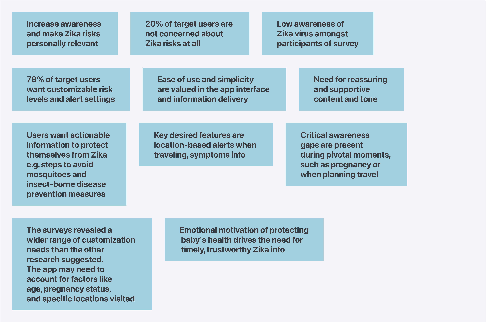

# Affinity Diagram

### Key insights

#### Surveys

<figure><picture><source srcset="../.gitbook/assets/Surveys-dark.png" media="(prefers-color-scheme: dark)"></picture><figcaption>
Surveys
</figcaption></figure>

#### Literature review

<figure><picture><source srcset="../.gitbook/assets/Literature review-dark.png" media="(prefers-color-scheme: dark)"></picture><figcaption>
Literature review
</figcaption></figure>

#### Competitive analysis

<figure><picture><source srcset="../.gitbook/assets/Competitive analysis-dark.png" media="(prefers-color-scheme: dark)"></picture><figcaption>
Competitive analysis
</figcaption></figure>

### Grouped insights into key themes

Synthesised key themes are;&#x20;

1. Location-specific and timely information
2. Increasing awareness and prevention
3. Interface and content

<figure><picture><source srcset="../.gitbook/assets/Group insights into themes-dark.png" media="(prefers-color-scheme: dark)"></picture><figcaption>
Grouped insights into themes
</figcaption></figure>

View key themes in PDF document


