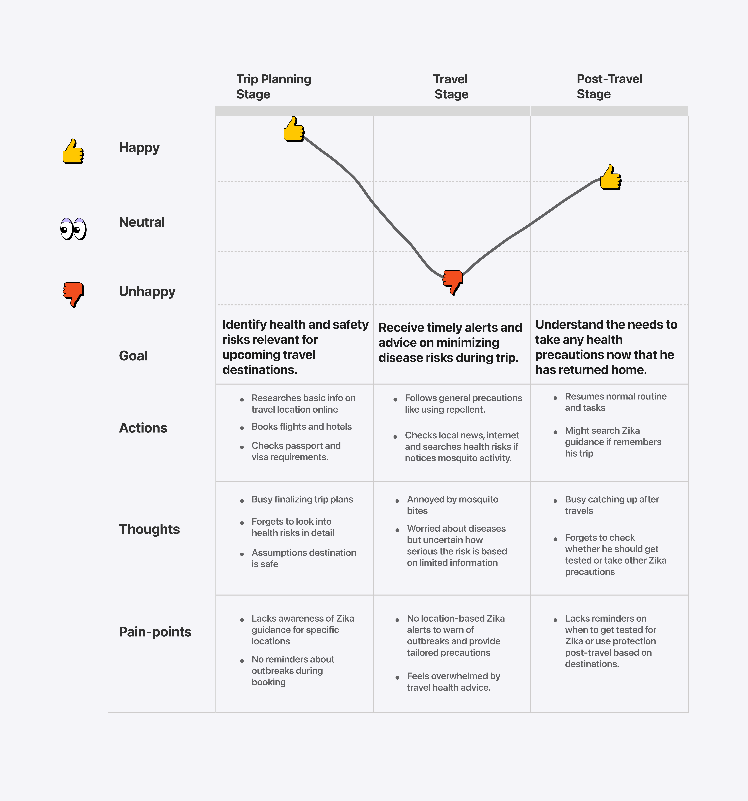

# User Journey Maps

### Pregnant women / couples planning pregnancy

User journey 1

<figure><picture><source srcset="../.gitbook/assets/Pregnant women and couples planning pregnancy-dark.png" media="(prefers-color-scheme: dark)"></picture><figcaption>
User journey map - Pregnant women and couples planning pregnancy
</figcaption></figure>

User journey map for pregnant women and couples planning pregnancy. View in PDF document.



### Outdoor workers

User journey 2

<figure><picture><source srcset="../.gitbook/assets/Outdoor workers-dark.png" media="(prefers-color-scheme: dark)"></picture><figcaption>
User journey map for outdoor workers
</figcaption></figure>

User journey map for outdoor workers. View in PDF document.



### Travelers

User journey 3

<figure><picture><source srcset="../.gitbook/assets/Travelers-dark.png" media="(prefers-color-scheme: dark)"></picture><figcaption>
User journey map for travelers workers
</figcaption></figure>

User journey map for travelers workers. View in PDF document.


