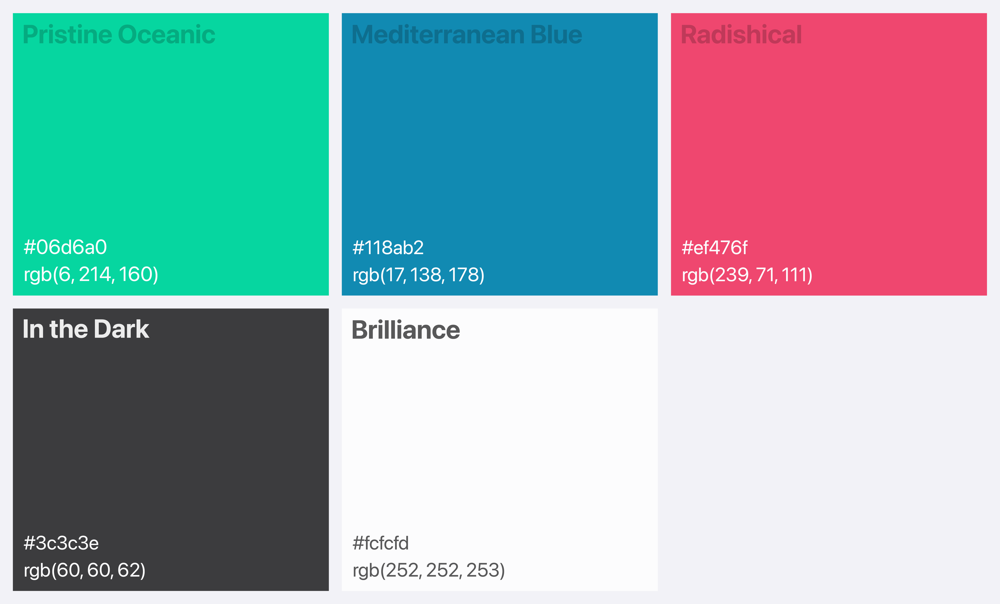

# Visual Identity

### Primary logo

Our logo marries a striking mosquito icon with the word "Zika" — a visual testament to our app's mission to alert and protect against the Zika virus

<figure><picture><source srcset="../.gitbook/assets/logo-dark.png" media="(prefers-color-scheme: dark)"></picture><figcaption>
Zika logo
</figcaption></figure>

### Logo Symbol

The mosquito icon stands alone as the symbol of our fight against Zika, embodying the app's core focus on vigilance and prevention.

<figure><picture><source srcset="../.gitbook/assets/Logo symbol-dark.png" media="(prefers-color-scheme: dark)"></picture><figcaption>
Logo symbol
</figcaption></figure>

### Logo wordmark

The "Zika" wordmark, designed with clarity and impact in mind, represents our app's dedicated purpose in a textual form.

<figure><picture><source srcset="../.gitbook/assets/wordmark-dark.png" media="(prefers-color-scheme: dark)"></picture><figcaption>
Logo wordmark
</figcaption></figure>

### Clear space

Around our logo, there's a buffer zone – a clear space that ensures our emblem stands out distinctly wherever it's placed, maintaining its visibility and impact.

<figure><picture><source srcset="../.gitbook/assets/clear-space-dark.png" media="(prefers-color-scheme: dark)"></picture><figcaption>
Logo clear space
</figcaption></figure>

### Logo Background

Our logo floats on brand colors, uncluttered space, ensuring it stands out clearly and is instantly recognizable.

<figure><picture><source srcset="../.gitbook/assets/background-dark.png" media="(prefers-color-scheme: dark)"></picture><figcaption>
Logo on background colors
</figcaption></figure>

### Colors

<figure><picture><source srcset="../.gitbook/assets/visual-color-dark.png" media="(prefers-color-scheme: dark)"></picture><figcaption>
Brand colors
</figcaption></figure>

* **Pristine Oceanic:** This refreshing bluish-green symbolizes clarity and calm, mirroring the app's promise of clear, reliable information.
* **Mediterranean Blue:** A deeper, trust-inspiring hue, used for highlights and critical alerts.
* **Radishical:** This bright, warm red is reserved for prompting urgent action, like alert notifications.
* **In the Dark:** A grounding, dark grey color for text ensuring optimal readability.
* **Brilliance:** A luminous white, emanating hygiene and safety, primarily used for backgrounds and containers.

### Typography

Friendly yet assertive, ensuring messages are communicated with clarity and urgency, making the app accessible to all users.

<figure><picture><source srcset="../.gitbook/assets/typography-dark.png" media="(prefers-color-scheme: dark)"></picture><figcaption>
SF Pro Display and SF Pro are type-faces for Zika alert app
</figcaption></figure>

#### Typescale

<figure><picture><source srcset="../.gitbook/assets/typescale-dark.png" media="(prefers-color-scheme: dark)"></picture><figcaption></figcaption></figure>

[Modular-scaling](https://www.modularscale.com/?16\&px&1.333)
