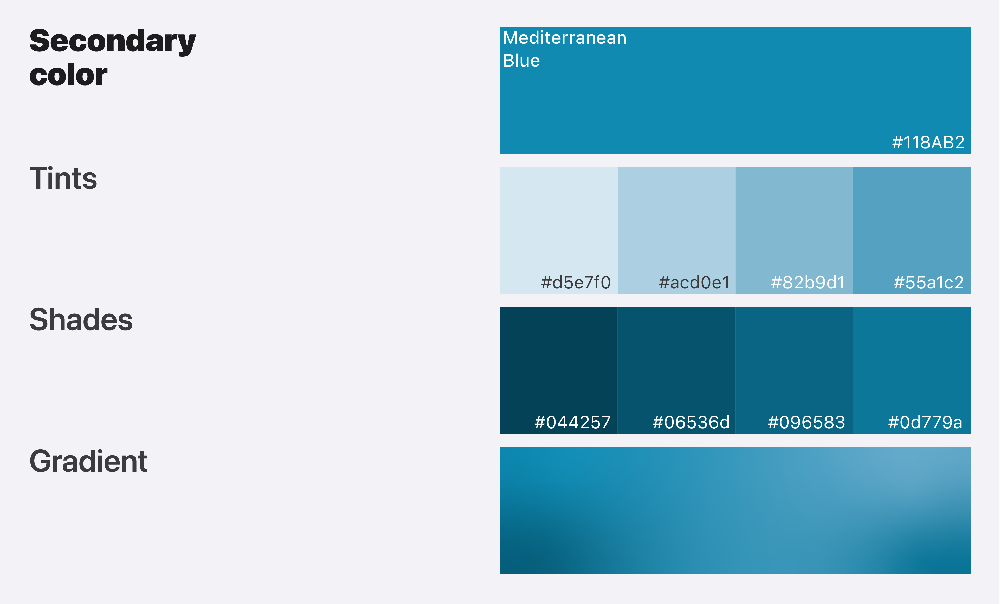

# Brand Identity

### Logo

<figure><figcaption>
Aedes mosquitoes symbol with Zika wordmark
</figcaption></figure>

### Logo symbol

<figure><figcaption>
Aedes mosquitoes logo symbol
</figcaption></figure>

### Logo wordmark

<figure><figcaption>
Zika logomark
</figcaption></figure>

### Primary color

<figure><figcaption>
Pristine Oceanic green is primary color
</figcaption></figure>

### Secondary color

<figure><figcaption>
Mediterranean blue is secondary color
</figcaption></figure>

### Accent

<figure><figcaption>
Radishical pink is accent color
</figcaption></figure>

### Typography

<figure><figcaption>
Font is SF Pro
</figcaption></figure>
