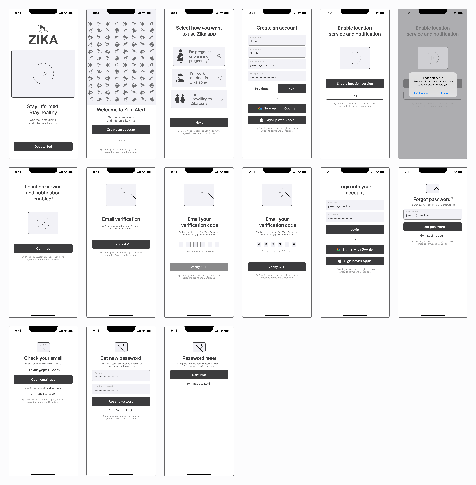

# Wireframes

Zika alert app wireframes is based on iOS design principles and specifications

### Onboarding Screens

<figure><figcaption>
Onboarding screens wireframe
</figcaption></figure>

View Onboarding wireframes in PDF document



### Map Screens

<figure><figcaption>
Map screens wireframe
</figcaption></figure>

View Onboarding wireframes in PDF document.



### Alert Screen

<figure><figcaption>
Alert screen wireframe
</figcaption></figure>

View Alert wireframe in PDF document.



### Health Information Screens

<figure><figcaption>
Health information screens wireframe
</figcaption></figure>

View Health Information wireframe in PDF document.



### Settings Screens

<figure><figcaption>
App settings screens wireframe
</figcaption></figure>

View Alert wireframe in PDF document.


